# Aviation Runway System Cyber Security Case Study 02

### [ MITM Attack on PLC–HMI  IEC 60870-5-104 OT Control Channel ]

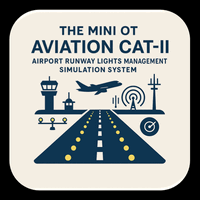

The modern airports rely heavily on integrated OT, IT, and IoT systems to ensure safe and efficient runway operations and these systems have also become potential targets for cyberattacks. In this case study, we use our [**Mini OT Aviation CAT-II Airport Runway Lights Management Simulation System**](https://www.linkedin.com/pulse/aviation-runway-lights-management-simulation-system-yuancheng-liu-5rzhc) (v_0.2.1) to demonstrate how a malicious red-team-actor could exploit misconfigurations and weaknesses in the cyber range's PLC-HMI IEC104 control channel through a **Man-in-the-Middle (MITM) attack**. 

This case study is designed as part of our IT/OT/IoT cybersecurity workshop to show six different attack vectors which may happened in the real world system. The scenario assumes an attacker compromises an unauthorized third party IoT surveillance camera inside the Tower ATC Control Room, and from there intercepts and manipulates OT traffic between the HMI and PLCs. The simulated attack results in a temporary denial of runway light control, escalating into an aircraft traffic control service disruption and ultimately creating a Aircraft-fuel-low caution situation.

To guide readers through the exercise, I will cover the following sections:

- Background of the attack scenario and hypotheses used in the case study.
- The warning, alert, and safety protection systems of the Runway Lights Management Simulation System.
- How misconfigurations in the runway light tower network created exploitable weak points.
- Step-by-step attack path with technical details of the MITM control channel manipulation.
- Demonstration of the attack’s impact and its use in training incident response teams.

**Important Note:** This case study takes place in a controlled cyber range environment where vulnerabilities and misconfigurations are deliberately injected for training purposes. In real-world aviation systems, safety protections are more robust and most of the weaknesses described here would be addressed. The attacks demonstrated cannot be directly replicated on operational airport systems.

```python
# Author:      Yuancheng Liu
# Created:     2025/09/10
# Version:     v_0.2.1
# Copyright:   Copyright (c) 2025 Liu Yuancheng
```

**Table of Contents** 

[TOC]

------

### Introduction

This cyberattack case study demonstrates how multiple attack techniques can be combined to manipulate the control data flow channel between the Runway Light and Indicator Control HMI in the airport tower and a PLC responsible for controlling runway holding lights. By exploiting these weaknesses, the attacker is able to cause a **denial or delay of aircraft landing operations**, directly impacting air traffic control services. 

The case study will cover six types of cyber attack vector including:

- Supply chain compromise
- Malicious firmware updates & misconfigurations
- IEC61850-104 protocol imperfections
- Eavesdropping and packet tampering
- Man-in-the-Middle control hijacking
- Component-level denial of service

The entire case study and demonstration are conducted on the latest version of Mini OT Aviation CAT-II Airport Runway Lights Management Simulation System, which specifically designed for research, training, and cyber range exercises. All attack scenarios and techniques presented here are strictly for educational purposes, supporting IT/OT cybersecurity training and ICS-focused courses at different levels.

#### Introduction of the Aviation Cyber Range

The **Mini OT Aviation CAT-II Airport Runway Lights Management Simulation System** is a compact cyber-range platform developed to simulate the **Four** different levels OT environment of a Category II airport precision instrument runway lighting control system as shown in the below system structure diagram:

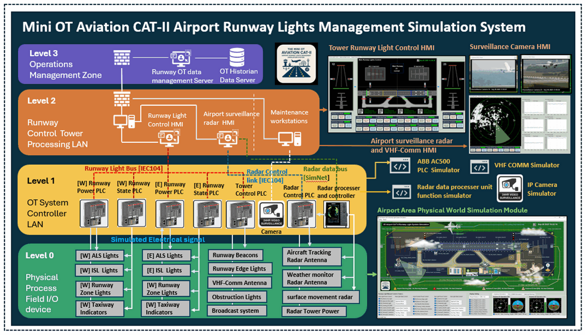

It provides the simulation modules from OT-Level 0 physical processes (pure runway device) such as the ALS and ILS light, Airport Surveillance Radar(ASR) system, VHF Comm and Cameras to the OT-Level 3 Operations Management Zone such as Tower control and monitoring HMI System. All the system design follows the FAA ATC "General Standard“. The platform simulate **Four** SCADA systems used for Aircraft Traffic Control: 

- **CAT-II Runway Light System** : The core system simulate 11 types of runway lights and visual indicators.
- **Airport Surveillance Radar System** : The minor assistant system simulate 3 types of radar.
- **Radio Communication System** : The minor assistant system simulated the VHF/UHF pilot-tower and telephone tower-ground communications.
- **Surveillance Camera System** : The landing and take off runway airplane monitor IP camera system.

Currently the cyber range is update to version v_0.2.1 for more introduction, please refer to the v_0.0.1 introduction doc: https://www.linkedin.com/pulse/aviation-runway-lights-management-simulation-system-yuancheng-liu-5rzhc


#### Demo System Environment Configuration

In real-world airports, IT and OT infrastructures are robust, isolated, and designed to resist most currently known cyberattacks. To create a practical training environment for this case study, we deliberately introduced hypothetical weak points and misconfigurations into our cyber range platform. These assumptions allow us to explore how an attacker might exploit vulnerabilities in a less-protected system, without suggesting that such flaws exist in operational airport networks.

The demo network configuration (see figure above) consists of four distinct subnets and a total of 17 virtual machines (VMs) as shown below:

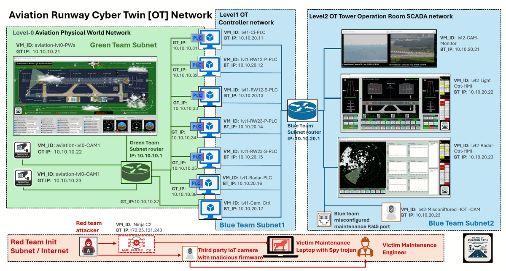

- **Green Team Subnet** – Represents the physical world connections between devices and PLCs. This subnet is **not directly accessible** to the red team attacker.

- **Blue Team Subnet 1** – Simulates the communication network between the runway tower control room and PLCs. It is protected by IP routing controls and also **not directly accessible** to the attacker.

- **Blue Team Subnet 2** – Represents the **isolated network of the runway control tower**, including SCADA HMIs and monitoring systems. Although attackers cannot connect directly, this subnet may be **indirectly exposed** through maintenance activity or misconfigured devices.

- **Red Team Subnet** – Simulates the attacker’s environment, including C2 infrastructure and compromised third-party IoT devices. Attackers cannot directly bridge into the Blue Team Subnet2 without leveraging an **intermediary path**.

A critical design rule in this simulation is that **no individual has the simultaneous access to both the attacker’s environment and the isolated OT network**. 


#### Case Study Scenario Misconfiguration Hypotheses

Based on the previous environment introduction, we understand there is no way for the red  team attacker to access any part of the OT network in real time. Instead, the attacker must rely on a **careless maintenance engineer** and his compromised laptop to bridge the gap. This creates a realistic insider-like threat vector that highlights the risks of poor endpoint hygiene.

We defined **five key hypotheses** regarding weak points and misconfigurations in this cyber range system:

- **Hypothesis 1** :  A careless maintenance engineer connects his laptop to the internet, giving the attacker an opportunity to install a spy trojan.

- **Hypothesis 2** :  The same laptop is later physically connected to the isolated Level-3 runway OT network for testing, enabling the pre-installed trojan to act inside the control environment.

- **Hypothesis 3** : After leaving the control tower, the maintenance engineer reconnects his laptop to the internet, allowing the attacker to extract sensitive network information and communication samples collected by the trojan.

- **Hypothesis 4** :  The attacker carries out a supply chain compromise, embedding malicious code into the firmware of the IoT camera, which then acts as a stealth access point within the OT environment.
- **Hypothesis 5** : A misconfiguration places a third-party IoT surveillance camera on the same subnet as the runway light control HMI, the maintenance engineer update the camera with the malicious firmware creating an unexpected point of exposure.

These hypotheses, while unrealistic for real-world aviation systems, provide a **controlled, flexible training ground** where we can simulate supply chain compromise, misconfiguration abuse, insider risk, and OT-specific attack paths such as **MITM manipulation of the IEC104 control channel**.


------

### Case Study Attack Scenario and Path

The diagram below illustrates the simulated attack path used in this case study. It shows how an attacker — starting from a compromised maintenance laptop and a tampered IoT camera — establishes a Man-in-the-Middle (MITM) on the **PLC ↔ HMI IEC-104 control channel** to modify the runway holding-light commands data ASDU section, causing a takeoff delay and forcing another inbound aircraft to loiter in the holding pattern until a fuel-low alarm is raised.

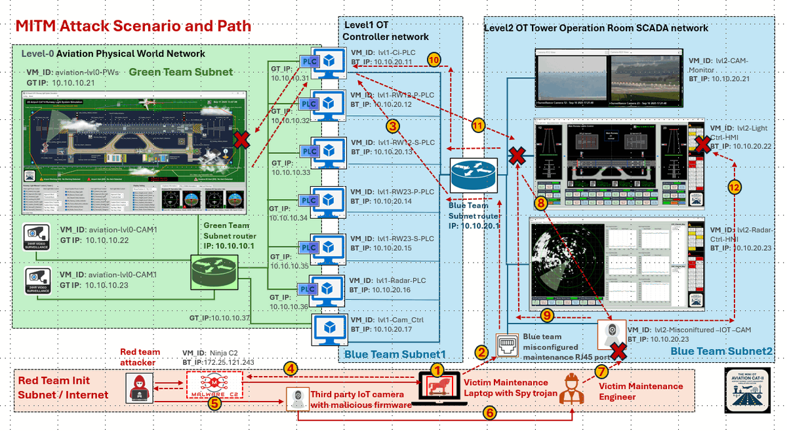

The end-to-end attack unfolds across the following staged timeline (T1 → T13) as marked in the diagram. Each step describes the attacker’s actions, the role of the compromised maintenance engineer as an unwitting insider, and the technical method used to intercept and alter OT traffic.

- **Step-T1 — Initial compromise & beaconing:** The attacker infects the maintenance engineer’s laptop with a spy trojan (via phishing, malvertising, or pre-compromise). The trojan installs network-scanning and packet-capture payload and awaits commands from the attacker’s C2 infrastructure. When the laptop is online, captured telemetry and packets are exfiltrated to C2.
- **Step-T2 — Physical access to OT:** The maintenance engineer, unaware of the infection, disconnects from the internet and takes the laptop into the runway tower room to perform maintenance tasks. He plugs the laptop into a tower RJ45 test port that is connected to the isolated OT environment.
- **Step-T3 — Local reconnaissance inside OT:** While connected, the trojan passively records network traffic between the victim laptop and the Level-1 runway PLC (PLC01), capturing IEC-104 frames, addressing, and sequence patterns used for holding-light control.
- **Step-T4 — Data return & analysis:** After leaving the tower and reconnecting to the internet, the laptop uploads the harvested packet captures to the attacker’s C2. The attacker downloads these captures for offline analysis.
- **Step-T5 — Attack development:** Using the captured traffic and any leaked documentation, the attacker reverse-engineers the IEC-104 messaging, HMI/PLC IPs and control bits. They develop a MITM routine capable of parsing and modifying specific IEC-104 commands and responses. The attacker embeds this MITM payload into a “customized” firmware image for a third-party IoT surveillance camera.
- **Step-T6 — Supply-chain delivery:** The attacker executes a supply-chain or logistics trick to get one camera flashed with the malicious firmware and delivered into the maintenance flow.
- **Step-T7 — Device replacement:** The maintenance engineer (or on-site contractor) replaces a broken camera in the tower with the tampered unit without inspecting its firmware or network placement.
- **Step-T8 — ARP spoofing & traffic redirection:** Once deployed, the malicious camera activates and performs ARP spoofing / local routing manipulation to position itself as a transparent MITM between PLC01 and the HMI, causing traffic to flow PLC01 → Camera → HMI.
- **Step-T9 — Packet parsing & trigger logic:** The camera’s MITM routine parses live IEC-104 frames and waits for a specific command/sequence (the “trigger”) that indicates an operator is issuing a takeoff holding-light change.
- **Step-T10 — Command tampering (takeoff blocked):** When the tower operator presses the HMI button to turn the takeoff holding-light **OFF** (allowing the aircraft to start takeoff), the MITM intercepts and flips the relevant control bit so the command delivered to PLC01 indicates **ON** (hold). The pilot, seeing the physical light, keeps the aircraft at the take off holding area.
- **Step-T11 — State-feedback suppression:** Simultaneously the MITM modifies PLC → HMI state reports so the HMI displays normal/expected PLC states. This conceals the manipulation from the tower operator and prevents operator corrective action.
- **Step-T12 — Cascading operational impact:** An inbound aircraft (Plane-2) on final approach observes the runway as occupied (or receives ATC instruction consistent with runway occupied) and must abort/execute a missed approach, climbing back into the holding pattern.
- **Step-T13 — Safety escalation:** After extended loitering in the holding pattern, the inbound pilot declares a **fuel-low** condition to ATC, prompting priority handling and a safety incident. The tower remains unaware the runway was intentionally withheld due to the MITM manipulation.

This scenario demonstrates how a blended attack — combining endpoint compromise, supply-chain tampering, and an OT-aware MITM — can create dangerous operational outcomes even when primary OT networks are designed to be isolated. All steps above are executed in our cyber range under controlled conditions; they are intended solely to highlight attack mechanics, detection opportunities, and mitigation strategies for training and research.


------

### Cyber Range Warning & Alert System

Before I walk through the demo attack, it’s important to understand the **safety protection mechanisms** built into the cyber range. These mechanisms simulates the real-world Tower ATC safeguards so you can see why the attacker must perform specific reconnaissance and bypass actions to remain covert.

**Purpose & high-level behavior** : The PLCs and HMI in our simulator implement **auto state verification** and a layered **warning/alert generation** system. Whenever an operator issues a control action (e.g., turning on the runway or approach-bar light to release state), the PLCs compare commanded states with the light state sensor feedback. Any mismatch or abnormal condition is flagged and pushed to the tower HMI and to the physical-world simulator display so operators can quickly detect and respond to faults. The PLC light sensor and control logic follow the same logic in this article: https://www.linkedin.com/pulse/use-plc-remote-control-circuit-breaker-power-system-yuancheng-liu-7ljxc, the current version provide 11 types of runway warning, 18 types of runway alert and 4 types of airplane alert.

**How warnings & alerts are visualized**

- The **Physical World Simulator** overlays flashing warning/alert icons directly on the simulated equipment (e.g., a runway light or beacon) so the operator immediately sees the affected component.
- The **HMI** mirrors those notifications in a dedicated **Warning & Alert Indicators panel**, where alarms flash and provide contextual information (type, affected device, timestamp).

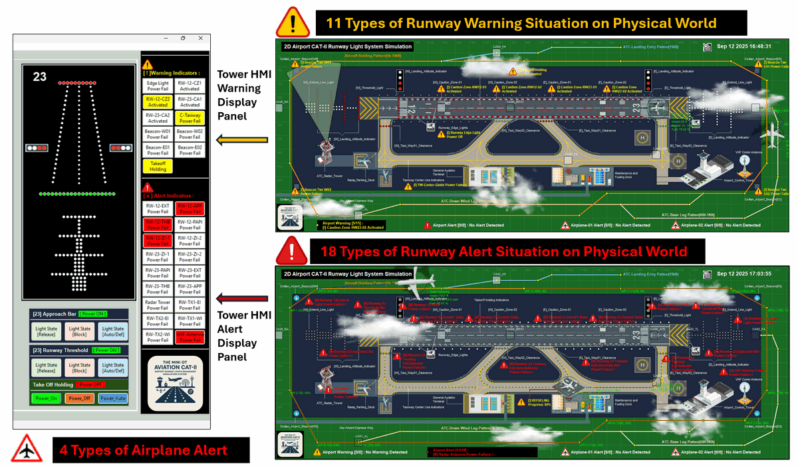

**Detection logic example**:

- Operator press control button → HMI sends IEC-104 control command → PLC actuates device and reads local sensor(s) → PLC reports actual state back to HMI.
- If PLC sensor state ≠ commanded state within a configured timeout or tolerance, the PLC raises an **alert**; if an operator action requires attention but is not critical, a **warning** may be shown instead. The PLC/HMI follow the same sensor/control logic used in our PLC remote-control examples.

**Catalog of alerts & warnings**

- **Runway Warnings (11)** — e.g., Takeoff Holding Light Activated; Beacon Tower power warnings; Runway edge light power off; caution-zone ember lights activated.
- **Runway Alerts (18)** — detailed power/state-mismatch and sensor-failure alerts across approach bars, threshold bars, PAPI, taxiway indicators, radar antenna and VHF antenna.
- **Airplane Alerts (4)** — e.g., Aircraft fuel-low, aircraft emergency climb, radar proximity, runway-light conflict.

These categories provide multi-tiered situational awareness: warnings for operator attention, alerts that generally require immediate incident-response procedures. 

Operational Response

When a **warning** appears the operator is expected to double-check the physical state and proceed with corrective action. When an **alert** occurs the operator must **invoke incident response procedures** (isolate, verify sensors, roll back commands, call maintenance, etc.).

During the cyber attack, the attacker needs to neutralize or evade these protections,  suppress or forge PLC → HMI feedback so the HMI continues to display “normal” despite actual device state changes.


------

### Attack Scenario Demonstration 

This section will introduce the tools, the analysis and the critical steps of the attacker's action of the whole attack scenario steps by steps. 

#### Step-T1 → T2 — Initial compromise & beaconing

This demo section covers the attacker’s first two stages: 

- (1) silently implanting a light-weight eavesdropper on the maintenance engineer’s laptop,
- (2) waiting for the engineer to carry that infected endpoint into the isolated OT environment so the implant can capture PLC to victim laptop traffic.

**Toolset used** : The attacker uses a red-team toolkit I developed — **Project Ninja RT Framework** (RTC2 & Trojan-Malware Cyber-Attack Simulation System). Project Ninja provides a C2 console with modular payloads that can be pushed to a target, including a small “light agent” designed for long-duration packet capture and exfiltration. The toolkit workflow is shown in the diagram below.

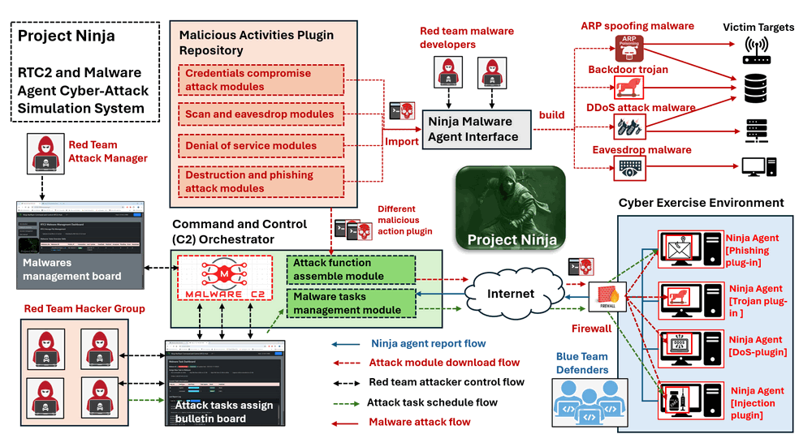

For the detail introduction about this attack system, you can check this document: https://www.linkedin.com/pulse/project-ninja-framework-rtc2-trojan-malware-cyber-attack-liu-loihc

**Infection & payload deployment**
From the C2 web trojan control dashboard the attacker enumerates the victim laptop and selects the light agent payload (Function #9 in the console). Using the GUI, the attacker configures the capture parameters:

- target NIC: `ethernet-5` (laptop local RJ45 interface the engineer will later link into the tower test RJ45 port)
- capture duration / interval: `43,200` seconds → **12 hours** (the agent segments captures into several pcap files)
- post-capture behavior: auto-remove the payload module after scheduled recordings finish

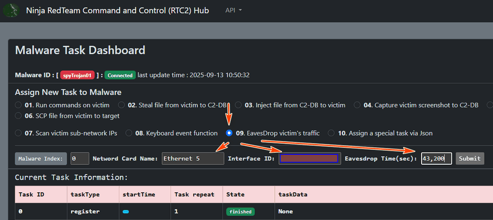

After the payload is installed (Step-T1), the attacker waits for the scheduled maintenance window. On the next workday the maintenance engineer disconnects from the internet, enters the runway tower, and plugs the laptop into the isolated Blue Team Subnet-2 RJ45 test port (Step-T2). During that session the implant captures the HMI ↔ PLC traffic (takeoff/holding light tests and state reports) exactly as planned.

Once deployed, the trojan runs in a low-visibility mode and periodically attempts to beacon to the attacker’s C2 to receive commands and to exfiltrate collected pcaps when the laptop regains internet connectivity.


#### Step-T3 → T4 — Data return, analysis & attack decision

After the maintenance session ends and the engineer reconnects to the internet after he back to home, the implanted trojan beacons C2 and exfiltrates its captures when the attacker uses the built-in “02 — Steal File from Victim to C2-DB” function.(as shown below). 

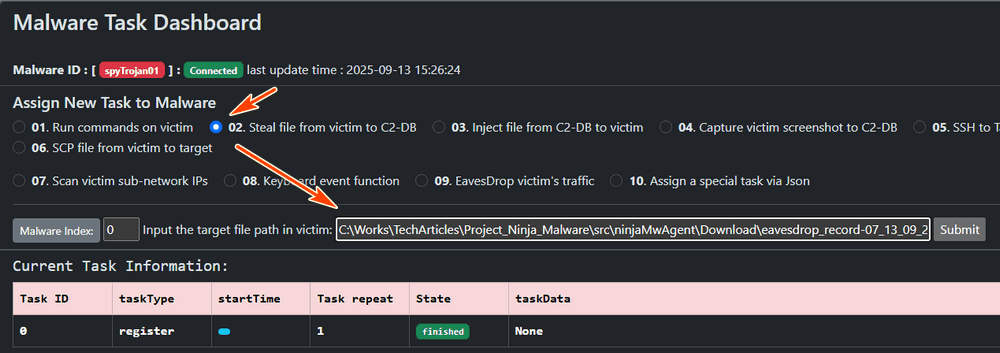

After the task finished, the uploaded PCAPs appear in the C2 file store (as shown below), and the attacker downloads them from C2 to his local computer to do the offline analysis.

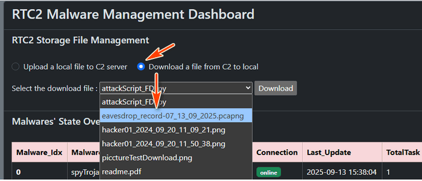

After got the "eavesdrop_record-07_13_09_2024.pcapng", the attacker start to analysis the packet data and find the PCAPs contained some Layer-2/3 traffic and IEC-104 frames captured while the laptop was connected to the isolated Blue-Team subnet. The key artifacts recovered during analysis included:

- IEC-104 ASDU control frames (command requests from Laptop to PLC which also used by HMI to PLC).
- PLC → Laptop state reports (measurement/quality points which may also sued by PLC to HMI).
- IP addressing and mapping for HMI and PLC (e.g., PLC01 = `10.10.20.11`).
- Sequence/timing patterns and APCI counters used by the IEC-104 session.

**Protocol & environment constraints discovered**

Based on the document and analysis the attack find careful packet inspection revealed several important defensive factors that limited simple attack options:

- **PLC write whitelist** The PLC enforces an allowed-write policy white list to make sure only the HMI machine can send the PLC state change command to PLC to against false-command injection attack unless the attacker can bypass PLC access controls.
- **Measurement-point persistence:** Light states are maintained in discrete measurement IOAs that are expected to be updated by the PLC logic; simply injecting a false data will reject by PLC directly.
- **APCI sequence/acknowledgement counters:** IEC-104 uses Tx/Rx sequence numbers in its APCI header (send/receive indices). A naive replay of previously captured frames would fail unless these sequence counters are correctly synchronized with the live HMI↔PLC session which is nearly impossible for packet replay attack to exactly match the sequence with the old recorded packet.

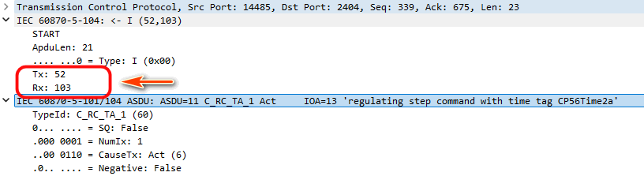

IEC 104 memory point change rule doc:  https://infosys.beckhoff.com/english.php?content=../content/1033/tf6500_tc3_iec60870_5_10x/984444939.html&id=

Because of these constraints, the attacker concludes that neither blind false-injection nor simple replay will reliably achieve stealthy control.The only way for him is do the man in the middle attack to replace the valid data send from HMI to the PLC. 

From the captured traffic the attacker locates the exact ASDU elements and IOAs involved in holding-light control as shown below: 

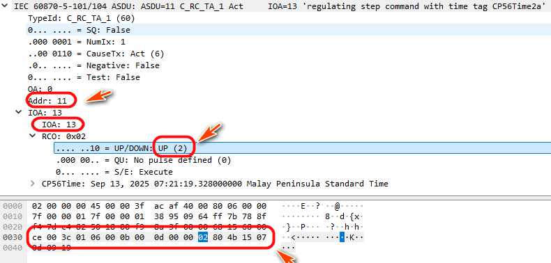

- Control ASDU references PLC control index `11`.

- The changeable IOA for the light control is `13`.

- The operator’s “step up” control is represented as a specific control value (`val=02`) within the ASDU.

The attacker also observes the readback pattern from PLC to HMI as shown below: 

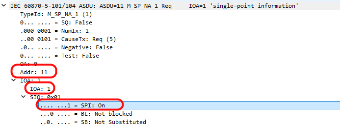

When a UP command is issued to change the light sate the PLC also get the sensor value then save to measurement IOA `1` transitions (OFF → ON) and later is read back by the HMI via a separate IEC-104 read/report sequence.

Putting the pieces together, the attacker models the feasible attack strategy: to remain covert they must **intercept and alter both directions** of the IEC-104 exchange — the HMI → PLC control ASDU (to flip the command) and the PLC → HMI measurement/report ASDU (to keep the HMI display consistent). The attacker sketches the MITM logic and required targets (ASDU RCO control field, and ASDU SPI/state report fields) in an attack assumption diagram as shown below:

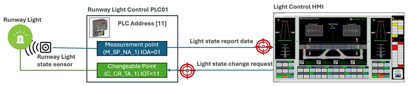


#### Step-T5 → T7 — Attack Development & Deployment

After analyzing the captured IEC-104 traffic and identifying the exact ASDU fields and IOAs involved in holding-light control, the attacker elects to implement an **in-path modification** strategy :  the only practical way to remain covert is to sit between the HMI and PLC and alter messages in both directions. 

- **HMI → PLC:** Modify the control request so an operator’s “step up / allow” becomes a “step down / hold” (or vice-versa).
- **PLC → HMI:** reverse readback/state reports so the HMI continues to show normal states and does not raise warnings/alerts.

As the Blue Team Subnet 2 is isolated from internet, rather than attempting a direct attack from the external Red-Team network, the adversary uses a **compromised third-party IoT camera** as the physical medium to achieve that in-path position.  Once connected to the same subnet as the light control HMI, the tampered camera positions itself to observe and influence HMI↔PLC flows by advertising misleading local network routing information (e.g., forged ARP mappings) so that traffic is routed redirect through the device. The attack flow diagram is shown below:

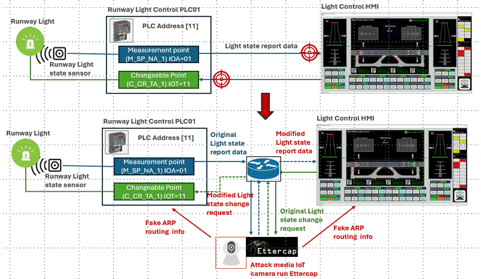

To build the MITM payload in this attack demo, we use the Ettercap which is Linux based comprehensive suite for man in the middle attack to implement the ARP spoofing and use the Ettercap filter to analysis the port 2042 traffic and do the bit replacement. For the detailed IEC104 ASDU data sequence, you can refer to this doc: https://www.linkedin.com/pulse/python-virtual-plc-simulator-iec-60870-5-104-protocol-yuancheng-liu-bov7c

The attacker wants to modify the control C_CT_TA_1 Step data if the HMI send step up [\x02] change to step down [\x01] (or vice-versa). To implement this, I built the bit Ettercap bit modification filter as shown below:

```C
if (ip.proto == TCP && ip.src = '10.10.20.11' && tcp.src == 2042 && ip.dst == '10.10.20.22') {
    if (search(DATA.data ,"\x3c\x01\x06\x00\x0b\x00\x0d\x00\x00\x02")) {
        replace("\x3c\x01\x06\x00\x0b\x00\x0d\x00\x00\x02", "\x3c\x01\x06\x00\x0b\x00\x0d\x00\x00\x01");
        msg("Modify the take off light on signal.\n");
        exit();
    }
       if (search(DATA.data ,"\x3c\x01\x06\x00\x0b\x00\x0d\x00\x00\x01")) {
        replace("\x3c\x01\x06\x00\x0b\x00\x0d\x00\x00\x01", "\x3c\x01\x06\x00\x0b\x00\x0d\x00\x00\x02");
        msg("Modify the take off light off signal.\n");
        exit();
    }
 }
```

When the take off holding light sensor send the light state back to the HMI, the attacker need to change the PLC response light ON state to OFF  (or vice-versa). To implement this, I build the Ettercap bit reverse filter as shown below:

```c++
if (ip.proto == TCP && ip.src = '10.10.20.22' && tcp.dst == 2042 && ip.dst == '10.10.20.11') {
    if (search(DATA.data ,"\x01\x01\x05\x00\x0b\x00\x01\x00\x00\x01")) {
        replace("\x01\x01\x05\x00\x0b\x00\x01\x00\x00\x01", "\x01\x01\x05\x00\x0b\x00\x01\x00\x00\x00");
        msg("reverse the take off light on signal.\n");
        exit();
    }
        if (search(DATA.data ,"\x01\x01\x05\x00\x0b\x00\x01\x00\x00\x00")) {
        replace("\x01\x01\x05\x00\x0b\x00\x01\x00\x00\x00", "\x01\x01\x05\x00\x0b\x00\x01\x00\x00\x01");
        msg("reverse the take off light off signal.\n");
        exit();
    }
}
```

After finished the filter, compile the filter file to a payload `*.ef` file which can load directly by Ettercap: 

```bash
etterfilter arp_mitm.filter -o mitm.ef
```

Then the attacker follow this example to package this logic malicious payload into a minimal firmware update component and integrates it into a camera image. : https://www.linkedin.com/pulse/ot-cyber-attack-workshop-case-study-06-replay-safety-surveillance-gcgxc, and add the auto run command  for ARP spoofing control with the blue team 2 subnet router IP address in the camera basic start up script: 

```bash
sudo ettercap -T -q -F mitm.ef -M ARP /10.10.20.1//
```

After finished all, the customized IoT camera is then delivered into the maintenance workflow and physically installed in the tower by the maintenance engineer who does not validate firmware or network configuration. Once active on the OT LAN, the camera begins local routing manipulation and selective ASDU substitution, acting only on narrowly defined trigger patterns (to reduce noise and lower chances of detection).


------

#### Step-T8 → T11 — MITM Attack to Delay the Plane Take-Off 

This stage describes what happens **after** the tampered IoT camera is installed in the tower and the attacker’s in-path logic goes live. The narrative below contrasts the normal operator/PLC/HMI behavior with what the operator observes while the MITM is actively manipulating both command and state traffic.

**Normal operation — “Take-off allow” (baseline)**

When operations are normal and the runway is clear, the tower operator's plane take off control is shown below:

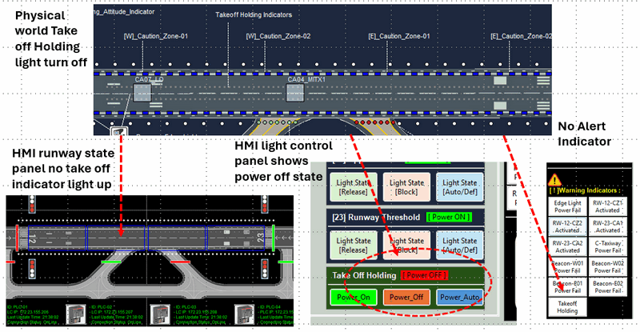

- The tower operator issues the **take-off holding-light OFF** command on the HMI to allow the aircraft to commence takeoff.

- The HMI sends an IEC-104 control to the PLC; the PLC switches the runway take-off holding light off at the device and reports the sensor state back to the HMI.
- The physical simulator (or real device) shows the light OFF; the HMI runway state panel and power control indicator both reflect the OFF state; no take-off warning is shown.

**Normal operation — “Take-off holding” (baseline)**

When there is a reason to hold a takeoff (e.g.,  another landed aircraft has not moved in taxiway), the tower operator's plane take off holding control is shown below:

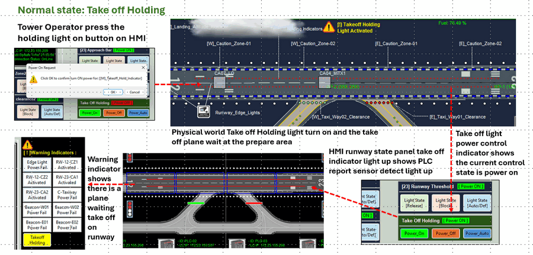

- The operator activates the **take-off holding light ON** via HMI to PLC.
- PLC change the physical world simulator's take off holding light on and the take off plane wait at the prepare area. 
- The HMI get sensor data from PLC and updates on its runway panel with 2 red lines.
- The HMI warning indicator area shows a take-off holding **warning** to identify a plane is waring for take off.

**MITM active — how the attack alters behavior**

Once the malicious camera becomes an in-path device, it selectively intercepts the HMI ↔ PLC exchange and performs two coordinated actions each time an operator changes the takeoff lights. 

- **Modify outgoing control command (HMI → PLC):**The MITM flips or substitutes the operator’s intended control action so the PLC receives a different command than what the operator issued (e.g., operator pressed OFF but PLC receives an ON—or vice-versa).

- **Forge/alter PLC readback (PLC → HMI):**
   Immediately after the PLC’s real sensor state is (or is not) changed, the MITM modifies the PLC → HMI report so the HMI displays the **expected** value (the one the operator expects to see), preventing an alert or obvious state mismatch on the console.

The observation will be shown below:

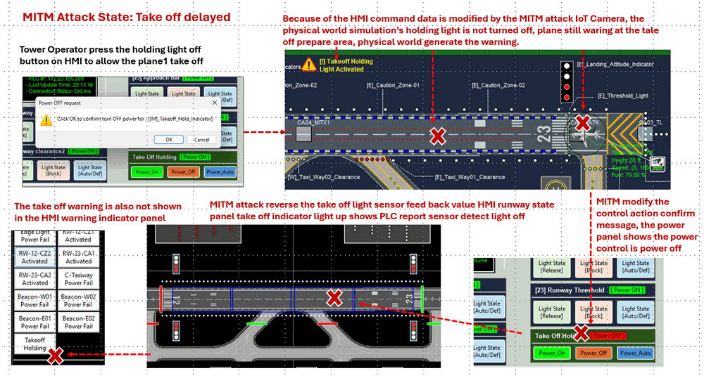

- Tower Operator press the holding light off button on HMI to allow the plane1 take off.
- The physical light remains in the opposite state to what the operator believes (e.g., operator turned it OFF but it remains ON in the real world). The aircraft at the hold point therefore does not initiate takeoff. 
- The HMI shows normal/expected status (power off), because the MITM manipulated PLC → HMI reports to hide the mismatch. The operator sees nothing unusual and assumes the command succeeded.
- The power control panel may indicate the expected command state (because that indicator reflects the manipulated feedback), further convincing the operator that the runway is clear.
- The warning message also not triggered for confirming no plane is at the take off holding state.

Now the IoT camera's man in the mid attack has delayed the plane take off procedure. 